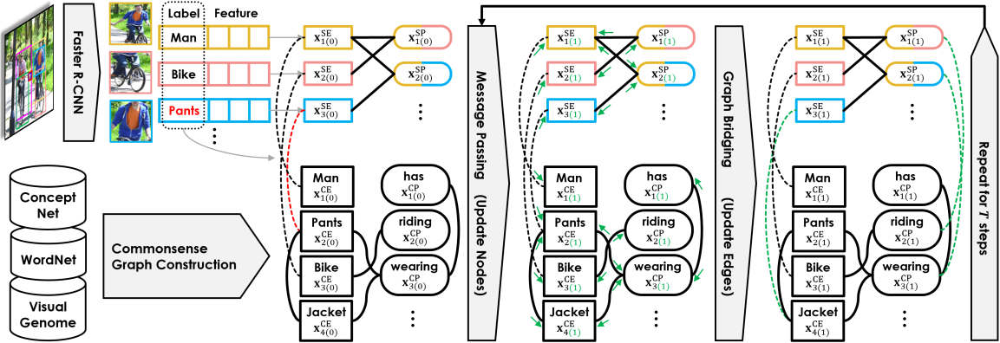

## Bridging Knowledge Graphs to Generate Scene Graphs

[Alireza Zareian](https://www.linkedin.com/in/az2407/), &nbsp; &nbsp; &nbsp; &nbsp; 
[Svebor Karaman](http://www.sveborkaraman.com/), &nbsp; &nbsp; &nbsp; &nbsp; 
[Shih-Fu Chang](https://www.ee.columbia.edu/~sfchang/)

[Digital Video and Multimedia - Columbia University](https://www.ee.columbia.edu/ln/dvmm/)

A machine learning framework for more powerful image understanding by incorporating common sense knowledge.

Published and presented at ECCV 2020 (European Conference on Computer Vision).

<a href="https://link.springer.com/chapter/10.1007/978-3-030-58592-1_36"><button>View Proceedings</button></a>
&nbsp; &nbsp; &nbsp; &nbsp; 
<a href="https://arxiv.org/abs/2001.02314"><button>Read on arXiv</button></a>
&nbsp; &nbsp; &nbsp; &nbsp; 
<a href="https://www.youtube.com/watch?v=wGPWYD1vU98"><button>Watch the Talk</button></a>

### Abstract

Scene graphs are powerful representations that parse images into their abstract semantic elements, i.e., objects and their interactions, which facilitates visual comprehension and explainable reasoning. On the other hand, commonsense knowledge graphs are rich repositories that encode how the world is structured, and how general concepts interact. In this paper, we present a unified formulation of these two constructs, where a scene graph is seen as an image-conditioned instantiation of a commonsense knowledge graph. Based on this new perspective, we re-formulate scene graph generation as the inference of a bridge between the scene and commonsense graphs, where each entity or predicate instance in the scene graph has to be linked to its corresponding entity or predicate class in the commonsense graph. To this end, we propose a novel graph-based neural network that iteratively propagates information between the two graphs, as well as within each of them, while gradually refining their bridge in each iteration. Our Graph Bridging Network, GB-Net, successively infers edges and nodes, allowing to simultaneously exploit and refine the rich, heterogeneous structure of the interconnected scene and commonsense graphs. Through extensive experimentation, we showcase the superior accuracy of GB-Net compared to the most recent methods, resulting in a new state of the art. We publicly release the source code of our method.

### Citation:
```
@InProceedings{Zareian_2020_CVPR,
author = {Zareian, Alireza and Karaman, Svebor and Chang, Shih-Fu},
title = {Weakly Supervised Visual Semantic Parsing},
booktitle = {IEEE/CVF Conference on Computer Vision and Pattern Recognition (CVPR)},
month = {June},
year = {2020}
}
```

### Quick Overview:



Given an input image, we first initialize a scene graph using a Faster R-CNN and ground the entity nodes via bridging edges on the external knowledge graph. Then we propagate messages to update node representations, and use them to update the entity and predicate bridges. This is repeated T times and the final bridge determines the output label of each node.

### Oral Talk:

[](https://www.youtube.com/watch?v=wGPWYD1vU98)


